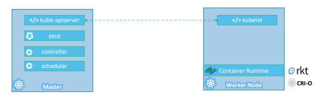
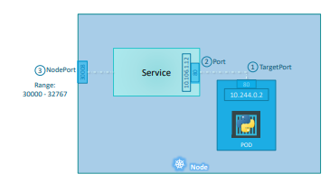

# K8
## Basic Terms
- Kubernetes - the hwile orchestration system 
- Kubectl - CLI to configure kubernetes and manage apps
- Noe - Single server in Kubernetes cluster
- Kubelet - Kubernetes agent running on nodes
- Control Plane - Set of containers that manage the cluster

    Includes API server, scheduler, controller manager, etcd(a disctiructed key value store), CoreDNS and more..

- Pod - one or more containers running together on one Node

    It's the basic unit of deployment. Containers are always in pods.

- Controller - For creating/updating pods and other objects

    Ideally, we can create pods with out controllers. But, it's recommended to have a controller for pods.

    Many types of Controllers inc. Deployment, ReplicaSet, StatefulSet, DarmonSet, Job, CronJob, etc.

- Service - network endpoint to connect to a pod
- Namespace - filtered group of objects in cluster (it's a filter on our view on the command line) // it's not the same as namespaces in Docker internals.
- Secrets, ConfigMaps and more..

> play-with-k8s.com or katacoda.com

Install microK8 and set `alias kubectl=microk8.kubectl` in profile.

## Basic Usage
### run, create, apply
```
kubectl run - for pod creation
kubectl create - create some resources via CLI or YAML
kubectl apply - create/update anything via YAML
```

### create pod with kubectl run
```
kubectl run my-nginx --image nginx
kubectl get pods
```
```sh
[be@fedora ~]$ kubectl get pods
NAME       READY   STATUS    RESTARTS   AGE
my-nginx   1/1     Running   0          2m54s
[be@fedora ~]$ kubectl get all
NAME           READY   STATUS    RESTARTS   AGE
pod/my-nginx   1/1     Running   0          3m11s

NAME                 TYPE        CLUSTER-IP     EXTERNAL-IP   PORT(S)   AGE
service/kubernetes   ClusterIP   10.152.183.1   <none>        443/TCP   42m
```

### clean up
```
kubectl delete pod my-nginx
```

### scaling ReplicaSets
```
kubectl run web --image nginx:latest
kubectl scale deploy/web --replicas 2
```

### inspecting k8 objects
```sh
kubectl get pods
kubectl get all
# get container logs
kubectl logs deployment/<name> [--follow --tail N]
kubectl logs -l run=web
# describe pods
kubectl describe pod/<name>
```

# Architecture and Components
Kubernetes architecture basically contains:
- worker nodes and
- master node for controlling the worker nodes

where a node means any system (physical or virtual) capable of running K8 services.



What distinguishes master node from workers is the services running on it. Wokers will have:
- kublet service 
- container runtime

and master will have:
- kube-apiserver
- etcd
- scheduler
- controller

Containers are hosten in the worker node. For example Docker containers, and to run docker containers on a system, we need a
container runtime installed. And that’s were the container runtime falls. 

The master server has the kube-apiserver and that is what makes it a master. Similarly the worker nodes have the kubelet agent that is responsible for interacting with the master to provide health information of the worker node and carry out actions requested by the master on the worker nodes. ETCD is a distributed reliable key-value store used by kubernetes to store all data used to manage the cluster.  The scheduler is responsible for distributing work or containers across multiple nodes. It looks for newly created containers and assigns them to Nodes. The controllers are the brain behind orchestration. They are responsible for noticing and responding when nodes, containers or endpoints goes down. The controllers makes decisions to bring up new containers in such cases.

# PODs
In K8s, he containers are encapsulated into a Kubernetes object
known as PODs. A POD is a single instance of an application. A POD is the smallest object, that you can create in kubernetes. The simplest of simplest cases were you have a single node kubernetes cluster with a single instance of your application running in a single docker container encapsulated in a POD. 

What if the number of users accessing your application
increase and you need to scale your application?

- First, we will add another pod in the same Node (NEVER will add another but same container in the POD).
- If we need to scale further, we will add another Node to the cluster.

## Multi-Container PODs
A single POD CAN have multiple containers, except for the fact that they are usually not multiple containers of the same kind. 


Sometimes you might have a scenario were you have a helper container, that might be doing some kind of supporting task for our web application such as processing a user entered data, processing a file uploaded by the user etc. and you want these helper containers to live along side your application container. In that case, you CAN have both of these containers part of the same POD, so that when a new application container is created, the helper is also created and when it dies the helper also dies since they are part of the same POD.

## Running a pod
```
kubectl run nginx --image nginx:alpine
              |             |
              |             +-- image to be used
              +-- name of pod
```
Get the list of pods:
```
kubectl get pods
NAME    READY   STATUS    RESTARTS   AGE
nginx   1/1     Running   0          11s
```

*You can access the running nginx server internally from the Node though. We will see networking and services we will get to know how to make this service accessible to end users.*

## Deleting a pod
```
kubectl delete pods/<name>
```

## Using YAML
K8s yaml definition contains 4 major parts:
```yml
apiVersion:
  # represents the verison of the obejcts
  # that we are planning to deploy.
  # We can use `kubectl api-resources` to get detailed information regarding
  # verious obejcts supported and their versions
kind:
  # refers to the type of object we are trying to create
metadata:
  # The metadata is data about the object like its name, labels etc.
  # It’s IMPORTANT to note that under `metadata`, you can only specify name or 
  # labels or anything else that kubernetes expects to be under metadata. 
  # You CANNOT add any other property as you wish under this. 
  # However, under `labels` you CAN have any kind of key or value pairs as you see fit. 
spec:
  # Depending on the object we are going to create, this is were 
  # we provide additional information to kubernetes pertaining to that object.
```

Example: a pod
```yml
# nginx-pod.yml
apiVersion: v1
kind: Pod
metadata:
  name: nginx
  labels:
    app: myapp
    type: front-end
spec:
  containers:
    - name: nginx
      image: nginx:alpine
```
Now run:
```
kubectl create -f <path/to/file.yml>
```
```sh
[be@fedora ~]$ kubectl create -f exercises/01-nginx-pod.yml 
pod/nginx created
[be@fedora ~]$ kubectl get pods -w # w - watch
NAME    READY   STATUS    RESTARTS   AGE
nginx   0/1     ContainerCreating   0          29s
nginx   0/1     ContainerCreating   0          30s
nginx   1/1     Running             0          34s
```

## Edit a Running Pod
```
kubectl edit pod <name>
```

# Replicas, Controllers and ReplicaSets
Controllers are the brain behind Kubernetes. They are processes that monitor kubernetes objects and respond accordingly. Here we are focusing on one controller - replication controller.


In our first scenario were we had a single POD running our application. What if for some reason, our application crashes and the POD fails? Users will no longer be able to access our application. To prevent users from losing access to our application, we would like to have more than one instance or POD running at the same time. That way if one fails we still have our application running on the other one. The replication controller helps us run multiple instances of a single POD in the kubernetes cluster thus providing High Availability.

So does that mean you can’t use a replication controller if you plan to have a single POD? No! Even if you have a single POD, the replication controller can help by automatically bringing up a new POD when the existing one fails. Thus the replication controller ensures that the specified number of PODs are running at all times. 


Another reason we need replication controller is to create multiple PODs to share the load across them. For example, in this simple scenario we have a single POD serving a set of users. When the number of users increase we deploy additional POD to balance the load across the two pods. If the demand further increases and If we were to run out of resources on the first node, we could deploy additional PODs across other nodes in the cluster. As you can see, the replication controller spans across multiple nodes in the cluster. It helps us balance the load across multiple pods on different nodes as well as scale our application when the demand increases.

*Replica Set is the new standard over Replication Controller. Both have the same purpose but they are not the same. Replication
Controller is the older technology that is being replaced by Replica Set. Replica set is the new recommended way to setup replication. However, whatever we discussed in the previous few slides remain applicable to both these technologies.*


## Replication Controller
```yml
# replication-controller-definition.yml
apiVersion: v1
kind: ReplicationController
metadata:
  name: myapp-rc
  labels:
    app: myapp
    type: front-end
spec:
  template:
    metadata:
      name: myapp-nginx
      labels:
        app: myapp
        type: front-end
    spec:
      containers:
        - name: nginx
          image: nginx:alpine
  replicas: 2
```

```
kubectl create -f exercises/replication-controller.yml 
```

```sh
be@fedora ~]$ kubectl create -f exercises/02-replication-controller.yml 
replicationcontroller/myapp-rc created
[be@fedora ~]$ kubectl get pods -w
NAME             READY   STATUS    RESTARTS   AGE
myapp-rc-gl8pl   1/1     Running   0          15s
myapp-rc-h9sfj   1/1     Running   0          15s
```

## Replica Set
```yml
# replication-controller-definition.yml
apiVersion: apps/v1
kind: ReplicaSet
metadata:
  name: myapp-rs
  labels:
    app: myapp
    type: front-end
spec:
  template:
    metadata:
      name: myapp-nginx
      labels:
        app: myapp
        type: front-end
    spec:
      containers:
        - name: nginx
          image: nginx:alpine
  replicas: 2
  selector: 
    matchLabels:
      type: front-end
```
Replica set requires a `selector` definition. The `selector` section helps the replicaset identify what pods fall under it. But why would you have to specify what PODs fall under it, if you have provided the contents of the pod-definition file itself in the template? It’s BECAUSE, **replica set can ALSO manage pods that were not created as part of the replicaset creation**. Say for example, there were pods created BEFORE the creation of the ReplicaSet that match the labels specified in the `selector`, the replica set will also take THOSE pods into consideration when creating the replicas.

The selector is not a REQUIRED field in case of a replication controller, but it is still available. When you kip it, as we did in the previous slide, it assumes it to be the same as the labels provided in the pod-definition file. In case of replica set a user input IS required for this property. And it has to be written in the form of matchLabels as shown here. **The `matchLabels` selector simply matches the labels specified under it to the labels on the PODs.** The replicaset selector also provides many other options for matching labels that were not available in a replication controller.


```
kubectl create -f exercises/replicaset.yml 
```

## Labels and Selectors
Why do we label our PODs and objects in kubernetes? Let us look at a simple scenario. Say we deployed 3 instances of our frontend web application as 3 PODs. We would like to create a replication controller
or replica set to ensure that we have 3 active PODs at anytime.  You CAN use it to monitor existing pods, if you have them already created, as it IS in this example. In case they were not created, the
replica set will create them for you. The role of the replicaset is to monitor the pods and if any of them were to fail, deploy new ones. The replica set is in FACT a process that monitors the pods. Now, how does the replicaset KNOW what pods to monitor. This is were labelling our PODs during creation comes in handy. 


We could now provide these labels as a filter for replicaset. Under the selector section we use the
matchLabels filter and provide the same label that we used while creating the pods.


Let's make sure if K8s is not lying by killing a running pod.
```sh
[be@fedora ~]$ kubectl get pods
NAME             READY   STATUS    RESTARTS   AGE
myapp-rs-2mtt9   1/1     Running   0          13m
myapp-rs-zqrxp   1/1     Running   0          97s
[be@fedora ~]$ kubectl delete pod/myapp-rs-2mtt9
pod "myapp-rs-2mtt9" deleted
```
Now if we check the running pods again:
```sh
[be@fedora ~]$ kubectl get pods
NAME             READY   STATUS    RESTARTS   AGE
myapp-rs-zqrxp   1/1     Running   0          24s
myapp-rs-lxrcc   1/1     Running   0          1m39s
```

## Scaling
Let’s look at how we scale the replicaset. Say we started with 2 replicas and in the future we decide to scale to 6. How do we update our replicaset to scale to 6 replicas. Well there are multiple ways to do it. 

The first, is to update the number of replicas in the definition file to 6. Then run the kubectl replace command specifying the same file using the –f parameter and that will update the replicaset to have 6 replicas.  

```yml
spec:
  template:
    ...
    spec:
      ...
  replicas: 6
  ...
```
```
kubectl replace -f exercises/replicaset.yml
```

The second way to do it is to run the kubectl scale command. Use the replicas parameter to provide the new number of replicas and specify the same file as input. You may either input the definition file or provide the replicaset name. *However, Remember that using the file name as input will not result in the number of replicas being updated automatically in the file.* 

```sh
kubectl scale -–replicas=6 –f exercises/replicaset.yml
# or 
kubectl scale -–replicas=6 replicaset myapp-rs
```

There are also options available for automatically scaling the replicaset based on load, but that is an advanced topic and we will discuss it at a later time

# Deployment


So far we have seen PODs, which deploy single instances of our
application such as the web application in this case. Each container is encapsulated in PODs. Multiple such PODs are deployed using Replication Controllers or Replica Sets. And then comes Deployment which is a kubernetes object that comes higher in the hierarchy. The deployment provides us with capabilities to upgrade the underlying instances seamlessly using rolling updates, undo changes, and pause and resume
changes to deployments.

## Creating a deployment
```yml
# deployment.yml
apiVersion: apps/v1
kind: Deployment
metadata:
  name: myapp-deployment
  labels:
    app: myapp
    type: front-end
spec:
  selector:
    matchLabels:
      app: myapp
  replicas: 2
  template:
    metadata:
      name: nginx
      labels:
        app: myapp
    spec:
      containers:
      - name: nginx
        image: nginx:alpine
        resources:
          limits:
            memory: "128Mi"
            cpu: "500m"
```
```
kubectl create –f exercises/deployment.yml
```

## Updates & Rollbacks


Whenever you create a new deployment or upgrade the images in an existing deployment it triggers a Rollout. **A rollout is the process of gradually deploying or upgrading your application containers.** When you first create a deployment, it triggers a rollout. A new rollout creates a new Deployment revision - Revision 1. In the future when the application is upgraded – meaning
when the container version is updated to a new one – a new rollout is triggered and a new deployment revision is created named Revision 2.This helps us keep track of the changes made to our deployment and enables us to rollback to a previous version of deployment if necessary.

```sh
# see the status of your rollout by running the command:
kubectl rollout status deployment/myapp-deployment
# see the revisions and history of rollout
kubectl rollout history deployment/myapp-deployment
```

### Deployment Strategies


There are two types of deployment strategies. Say for example you have 2 replicas of a web application instance deployed. One way to upgrade these to a newer version is to destroy all of these and then create newer versions of application instances. Meaning first, destroy the 2 running instances and then deploy 2 new instances of the new application version. **The problem** with this as you can imagine, is that during the period after the older versions are down and before any newer version is up, the **application is down** and inaccessible to users. This strategy is known as the **Recreate strategy**, and thankfully this is NOT the default deployment strategy.

The second strategy is were we do not destroy all of them at once. Instead we take down the older version and bring up a newer version one by one. This way the application never goes down and the upgrade is seamless.

**RollingUpdate is the default Deployment Strategy.**

```
kubectl apply –f deployment-definition.yml
```


When a new deployment is created, say to deploy 2 replicas, it first creates a Replicaset automatically, which in turn creates the number of PODs required to meet the number of replicas. When you upgrade your application, the kubernetes deployment object creates a NEW replicaset under the hoods and starts deploying the containers there. At the same time taking down the PODs in the old replica-set following a RollingUpdate strategy. 


Say for instance once you upgrade your application, you realize something isn’t very right. Something’s wrong with the new version of build you used to upgrade. So you would like to rollback your update. Kubernetes deployments allow you to rollback to a previous revision. To undo a change run the command `kubectl rollout undo <deployment name>`. The deployment will then destroy the
PODs in the new replicaset and bring the older ones up in the old replicaset and your application is back to its older format.

When you compare the output of the kubectl get replicasets command, before and
after the rollback, you will be able to notice this difference. Before the rollback the first replicaset had 0 PODs and the new replicaset had 2 PODs and this is reversed after the rollback is finished.

| Action | Command |
| --- | --- |
| Create | `kubectl create –f deployment-definition.yml` |
| Get | `kubectl get deployments` |
| Update | `kubectl apply –f deployment-definition.yml` <br/> `kubectl set image deployment/myapp-deployment nginx=nginx:1.9.1`|
| Status | `kubectl rollout status deployment/myapp-deployment` <br/> `kubectl rollout history deployment/myapp-deployment` |
| Rollback | `kubectl rollout undo deployment/myapp-deployment` |

## Exercise
Creating an nginx application with 2 replicas using the yml:
```yml
apiVersion: apps/v1
kind: Deployment
metadata:
  name: myapp-deployment
  labels:
    app: myapp
    type: front-end
spec:
  selector:
    matchLabels:
      app: myapp
  replicas: 2
  template:
    metadata:
      name: nginx
      labels:
        app: myapp
    spec:
      containers:
      - name: nginx
        image: nginx:alpine
        resources:
          limits:
            memory: "128Mi"
            cpu: "500m"
```

Create the deployment:
```sh
[be@fedora ~]$ kubectl create -f exercises/04-deployment.yml
deployment.apps/myapp-deployment created
```
Checking the status:
```sh
[be@fedora ~]$ kubectl rollout status deployment.apps/myapp-deployment
Waiting for deployment "myapp-deployment" rollout to finish: 0 of 2 updated replicas are available...
Waiting for deployment "myapp-deployment" rollout to finish: 1 of 2 updated replicas are available...
deployment "myapp-deployment" successfully rolled out
```

See the history of deployment:
```sh
[be@fedora ~]$ kubectl rollout history deployment.apps/myapp-deployment
deployment.apps/myapp-deployment 
REVISION  CHANGE-CAUSE
1         <none>
```
From the result, we can see that there is one revision for our application.

Let's edit the deployment:
```sh
[be@fedora ~]$ kubectl edit deployment.apps/myapp-deployment
```
Change the name in metadata and save.
```yml
template:
    metadata:
      creationTimestamp: null
      labels:
        app: myapp
      name: nginx-web 👈
```
It will trigger another role out.
```sh
[be@fedora ~]$ kubectl rollout status deployment.apps/myapp-deployment
Waiting for deployment "myapp-deployment" rollout to finish: 1 out of 2 new replicas have been updated...
Waiting for deployment "myapp-deployment" rollout to finish: 1 out of 2 new replicas have been updated...
Waiting for deployment "myapp-deployment" rollout to finish: 1 out of 2 new replicas have been updated... # new pods are getting created
Waiting for deployment "myapp-deployment" rollout to finish: 1 old replicas are pending termination...
Waiting for deployment "myapp-deployment" rollout to finish: 1 old replicas are pending termination... # old pods are terminated
deployment "myapp-deployment" successfully rolled out
```

Now, if we check the history again, there are two rollouts for our app.
```sh
[be@fedora ~]$ kubectl rollout history deployment.apps/myapp-deployment
deployment.apps/myapp-deployment 
REVISION  CHANGE-CAUSE
1         <none>
2         <none>
```

Another way to edit our deployment is to:
```sh
kubectl set image deployment/myapp-deployment nginx=nginx:1.9.1
```

```sh
[be@fedora ~]$ kubectl set image deployment/myapp-deployment nginx=nginx:1.9.1
deployment.apps/myapp-deployment image updated
[be@fedora ~]$ kubectl rollout status deployment.apps/myapp-deployment
Waiting for deployment "myapp-deployment" rollout to finish: 1 out of 2 new replicas have been updated...
Waiting for deployment "myapp-deployment" rollout to finish: 1 out of 2 new replicas have been updated...
Waiting for deployment "myapp-deployment" rollout to finish: 1 out of 2 new replicas have been updated...
Waiting for deployment "myapp-deployment" rollout to finish: 1 old replicas are pending termination...
Waiting for deployment "myapp-deployment" rollout to finish: 1 old replicas are pending termination...
deployment "myapp-deployment" successfully rolled out

# verifying the image
[be@fedora ~]$ kubectl describe deployment/myapp-deployment | grep -i image
    Image:      nginx:1.9.1
```

Let's roll back it now to revision 2 from revision 3:
```
kubectl rollout undo deployment/myapp-deployment
```
```sh
[be@fedora ~]$ kubectl rollout undo deployment/myapp-deployment
deployment.apps/myapp-deployment rolled back
[be@fedora ~]$ kubectl rollout status deployment.apps/myapp-deployment
Waiting for deployment "myapp-deployment" rollout to finish: 1 out of 2 new replicas have been updated...
Waiting for deployment "myapp-deployment" rollout to finish: 1 out of 2 new replicas have been updated...
Waiting for deployment "myapp-deployment" rollout to finish: 1 out of 2 new replicas have been updated...
Waiting for deployment "myapp-deployment" rollout to finish: 1 old replicas are pending termination...
Waiting for deployment "myapp-deployment" rollout to finish: 1 old replicas are pending termination...
deployment "myapp-deployment" successfully rolled out
```
```sh
[be@fedora learning-k8s]$ kubectl rollout history deployment.apps/myapp-deployment
deployment.apps/myapp-deployment 
REVISION  CHANGE-CAUSE
1         <none>
3         <none>
4         <none> 👈
```
We see that the second revision is gone and a 4th revision is added. That's because the new 4th revision is essentially same as the 2nd revision.

```sh
[be@fedora ~]$ kubectl describe deployment/myapp-deployment | grep -i image
    Image:      nginx:alpine
```

Now, let's try to mess things up by updating our deployment to use an nginx image that does not exist and see how k8s handle it.
```sh
# current deployment state..
# there are two replicas running
[be@fedora learning-k8s]$ kubectl get deployment
NAME               READY   UP-TO-DATE   AVAILABLE   AGE
myapp-deployment   2/2     2            2           30m
# update it to use a new image (that does not exist in docker hub)
[be@fedora learning-k8s]$ kubectl set image deployment/myapp-deployment nginx=nginx:thatDoesNotExist
deployment.apps/myapp-deployment image updated
# now if we see the deployment status:
# - 2 are ready (they are old revision's pods)
# - 1 is trying to come up
[be@fedora learning-k8s]$ kubectl get deployment
NAME               READY   UP-TO-DATE   AVAILABLE   AGE
myapp-deployment   2/2     1            2           31m
# k8s is not able to pull image. therefore it won't remove the existing
# replicas (unless and until next update is success, it will keep running
# previos revison's pods)
[be@fedora learning-k8s]$ kubectl get pods
NAME                                READY   STATUS           RESTARTS   AGE
myapp-deployment-b5f59897d-dkjcv    1/1     Running          0          5m47s
myapp-deployment-b5f59897d-mf5p6    1/1     Running          0          5m42s
myapp-deployment-5d9449f897-ww2l6   0/1     ErrImagePull 👈  0          17s
[be@fedora learning-k8s]$ 
```

> Creating and updating a deployment can be done by making changes in it's yaml definition and running `kubectl apply -f`
---

# Networking


Let us look at the very basics of networking in Kubernetes. We will start with a single node kubernetes cluster. The node has an IP address, say it is 192.168.1.2 in this case. This is the IP address we use to access the kubernetes node, SSH into it etc. So on the single node kubernetes cluster we have created a Single POD. As you know a POD hosts a container. **Unlike in the docker world were an IP address is always assigned to a Docker CONTAINER, in Kubernetes the IP address is assigned to a POD. Each POD in kubernetes gets its own internal IP Address.** In this case its in the range 10.244 series and the IP assigned to the POD is 10.244.0.2. 

#### So how is it getting this IP address? 
When Kubernetes is initially configured it creates an internal private network with the address 10.244.0.0 and all PODs are attached to it. When you deploy multiple PODs, they all get a separate IP assigned. The PODs can communicate to each other through this IP. But accessing other PODs using this internal IP address MAY not be a good idea as its subject to change when PODs are recreated. We will see BETTER ways to establish communication between PODs in a while. For now its important to understand how the internal networking works in kubernetes.

### Cluster Networking

How does networking work when you have multiple nodes in a cluster?


In this case we have two nodes running kubernetes and they have IP addresses 192.168.1.2 and 192.168.1.3 assigned to them. Note that they are not part of the same cluster yet. Each of them has a single POD deployed. As discussed in the previous slide these pods are attached to an internal network and they have their own IP addresses assigned. HOWEVER, if you look at the network addresses, you can see that they are the same. The two networks have an address 10.244.0.0 and the PODs deployed have the same address too. This is NOT going to work well when the nodes are part of the same cluster. The PODs have the same IP addresses assigned to them and that will lead to IP conflicts in the network. Now that’s ONE problem. 

When a kubernetes cluster is SETUP, kubernetes does NOT automatically setup any kind of networking to handle these issues. As a matter of fact, kubernetes expects US to setup networking to meet certain fundamental requirements. Some of these are that all the containers or PODs in a kubernetes cluster MUST be able to communicate with one another without having to configure NAT. All nodes must be able to communicate with containers and all containers must be able to communicate with the nodes in the cluster. Kubernetes expects US to setup a networking solution that meets these criteria. 

Fortunately, we don’t have to set it up ALL on our own as there are multiple pre-built solutions available. Some of them are the cisco ACI networks, Cilium, Big Cloud Fabric, Flannel, Vmware NSX-t and Calico. Depending on the platform you are deploying your Kubernetes cluster on you may use any of these solutions. For example, if you were setting up a kubernetes cluster from scratch on your own systems, you may use any of these solutions like Calico, Flannel etc. If you were deploying on a Vmware environment NSX-T may be a good option. If you look at the play-with-k8s labs they use WeaveNet. In our demos in the course we used Calico. Depending on your environment and after evaluating the Pros and Cons of each of these, you may chose the right networking solution.


So back to our cluster, with the Calico networking setup, it now manages the networks and Ips in my nodes and assigns a different network address for each network in the nodes. This creates a virtual network of all PODs and nodes were they are all assigned a unique IP Address. And by using simple routing techniques the cluster networking enables communication between the different PODs or Nodes to meet the networking requirements of kubernetes. Thus all PODs can now communicate to each other using the assigned IP addresses.

# Services


Kubernetes Services enable communication between various components within and outside of the application. Kubernetes Services helps us connect applications together with other applications or users. For example, our application has groups of PODs running various sections, such as a group for serving front-end load to users, another group running back-end processes, and a third group connecting to an external data source. It is Services that enable connectivity between these groups of PODs. Services enable the front-end application to be made available to users, it helps communication between back-end and front-end PODs, and helps in establishing connectivity to an external data source. Thus services enable loose coupling between microservices in our application.

There are mainly 3 services in K8s.

1. **NodePort** were the service makes an internal POD accessible on a Port on the Node. 
2. **ClusterIP** service creates a virtual IP inside the cluster to enable communication between different services such as a set of front-end servers to a set of backendservers. 
3. **LoadBalancer** provisions a load balancer for our service in supported cloud providers.

## NodePort


We deployed our POD having a web application running on it. How do we as an external user access the web page? First of all, lets look at the existing setup. The Kubernetes Node has an IP address and that is 192.168.1.2. My laptop is on the same network as well, so it has an IP address 192.168.1.10. The internal POD network is in the range 10.244.0.0 and the POD has an IP 10.244.0.2. 

Clearly, I cannot ping or access the POD at address 10.244.0.2 as its in a separate network. So what are the options to see the webpage? First, if we were to SSH into the kubernetes node at 192.168.1.2, from the node, we would be able to access the POD’s webpage by doing a curl. But this is from inside the kubernetes Node and that’s not what I really want. I want to be able to access the web server from my own laptop without having to SSH into the node and simply by accessing the IP of the kubernetes node. So **we need something in the middle to help us map requests to the node from a client through the node to the POD running the web container.**

That is where the kubernetes service comes into play. The kubernetes service is an object just like PODs, Replicaset or Deployments. One of its use case is to listen to a port on the Node and forward requests on that port to a port on the POD running the web application. This type of service is known as a **NodePort service because the service listens to a port on the Node and forwards requests to PODs**. 



There are 3 ports involved. The port on the POD were the actual web server is running is port 80. And it is referred to as the **targetPort**, because that is were the service forwards the requests to. The second port is the port on the service itself. It is simply referred to as the **port**. Remember, these terms are from the viewpoint of the service. The service is in fact like a virtual server inside the node. Inside the cluster it has its own IP address. And that IP address is called the Cluster-IP of the service. And finally we have the port on the Node itself which we use to access the web server externally. And that is known as the **NodePort**. As you can see it is 30008. That is because NodePorts can only be in a valid range which is from **30000 to 32767**.

Our pod definition:
```yml
apiVersion: v1
kind: Pod
metadata:
  name: nginx
  labels:  👈 # pod labels. we will use this in service's selector
    app: myapp
    type: front-end
spec:
  containers:
    - name: nginx
      image: nginx:alpine
      resources:
        limits:
          memory: "128Mi"
          cpu: "500m"
```

```yml
apiVersion: v1
kind: Service
metadata:
  name: myapp-nodeport
spec:
  type: NodePort
  ports:
    - targetPort: 80
      port: 80 # mandatory
      nodePort: 30080
  selector:
    app: myapp
    type: front-end
```
The only mandatory field is `port` .in the `ports` array If you don’t provide a targetPort it is assumed to be the same as port and if you don’t provide a nodePort a free port in the valid range between 30000 and 32767 is automatically allocated. 

We connect the pod and the service using `selector`s.

Now, start the pod and service using `kubectl create -f` or `kubectl apply -f` and then `curl http://192.168.1.2:30008` (here 1.2 is our node's IP) to get the webpage. ✌

---

Lets look at what happens when the PODs are distributed across multiple
nodes. In this case we have the web application on PODs on separate nodes in the cluster.


When we create a service , without us having to do ANY kind of additional
configuration, kubernetes creates a service that spans across all the nodes in the cluster and maps the target port to the SAME NodePort on all the nodes in the cluster. This way you can access your application using the IP of any node in the cluster and using the same port number which in this case is 30008. 😃

## ClusterIP


A full stack web application typically has different kinds of PODs hosting different parts of an application like a set of pods backend server, a set of PODs running a keyvalue store like Redis, another set of PODs running a persistent database like MySQL etc.  The web front-end servers need to connect to the backend-workers and the backend-workers need to connect to database as well as the redis services. 

#### So what IS the right way to establish connectivity between these PODs?
The PODs all have an IP address assigned to them. But these Ips as we know are not static, these PODs can go down anytime and new PODs are created all the time – and so **you CANNOT rely on these IP addresses for internal communication within the application**. 

A kubernetes service can help us group these PODs together and provide a single interface to access the PODs in a group. For example a service created for the backend PODs will help group all the backend PODs together and provide a single interface for other PODs to access this service. The requests are forwarded to one of the PODs under the service randomly. Similarly, create additional services for Redis and allow the backend PODs to access the redis system through this service. This enables us to easily and effectively deploy a microservices based application on kubernetes cluster. Each layer can now scale or move as required without impacting communication between the various services. Each service gets an IP and name assigned to it inside the cluster and that is the name that should be used by other PODs to access the service. This type of service is known as **ClusterIP**.

(We will be using the same pod definition is this example also and connect them with a service).

```yml
apiVersion: v1
kind: Service
metadata:
  name: myapp-clusterip
spec:
  type: ClusterIP # it's optional
                  # if nothing is mentioned, k8s defaults it to ClusterIP
  selector:
    app: myapp
    type: front-end
  ports:
  - port: 80
    targetPort: 80
```

## LoadBalancer


We have a 3 node cluster with Ips 192.168.1.2,3 and 4. Our application is two tier, there is a database service and a front-end web service for users to access the application. The default service type – known as ClusterIP – makes a service, such as a redis or database service available internally within the kubernetes cluster for other applications to consume. The next tier in my application happens to be a python based web front-end. This application connects to the backend using Service created for the redis service. To expose the application to the end users, we create another service of type NodePort. Creating a service of type NodePort exposes the application on a high end port of the Node and the users can access the application at any IP of my nodes with the port 30008. 

Now, what IP do you give your end users to access your application? You cannot give them all three and let them choose one of their own. What end users really want is a single URL to access the application. For this, you will be required to setup a separate Load Balancer VM in your environment. In this case I deploy a new VM for load balancer purposes and configure it to forward requests that come to it to any of the Ips of the Kubernetes nodes. I will then configure my organizations DNS to point to this load balancer when a user hosts http://myapp.com. Now setting up that load balancer by myself is a tedious task, and I might have to do that in my local or onprem environment. However, if I happen to be on a supported CloudPlatform, like Google Cloud Platform, I could leverage the native load balancing functionalities of the cloud platform to set this up. Again you don’t have to set that up manually, Kubernetes sets it up for you. Kubernetes has built-in integration with supported cloud platforms.

```yml
apiVersion: v1
kind: Service
metadata:
  name: myapp-lb
spec:
  type: LoadBalancer
  ports:
  - port: 80
    targetPort: 80
    nodePort: 30080
```

---

# Microservices Architecture
We will be deploying an application which is designed in the below architecture:


The source code  and related docs for the same can be found at https://github.com/dockersamples/example-voting-app. The images for the voting, result and worker apps are available on docker hub at kodekloud/examplevotingapp_vote, kodekloud/examplevotingapp_result and kodekloud/examplevotingapp_worker respectively.

yml definiton for pods:
- [voting-app-pod.yml](./exercises/votingapp/voting-app-pod.yml)
- [result-app-pod.yml](./exercises/votingapp/result-app-pod.yml)
- [redis-pod.yml](./exercises/votingapp/redis-pod.yml)
- [postgres-pod.yml](./exercises/votingapp/postgres-pod.yml)
- [worker-app-pod.yml](./exercises/votingapp/worker-app-pod.yml)

services:
- [voting-app-service.yml](./exercises/votingapp/voting-app-service.yml)
- [result-app-service.yml](./exercises/votingapp/result-app-service.yml)
- [redis-service.yml](./exercises/votingapp/redis-service.yml)
- [postgres-service.yml](./exercises/votingapp/postgres-service.yml)
- [worker-app-service.yml](./exercises/votingapp/worker-app-service.yml)

```sh
docker apply -f votingapp/
```
```sh
[be@fedora exercises]$ kubectl get all 
NAME                 READY   STATUS             RESTARTS        AGE
pod/postgres-pod     1/1     Running            0               27m
pod/redis-pod        1/1     Running            0               27m
pod/result-app-pod   1/1     Running            0               27m
pod/voting-app-pod   1/1     Running            0               27m
pod/worker-app-pod   0/1     Running   0   27m

NAME                     TYPE        CLUSTER-IP       EXTERNAL-IP   PORT(S)        AGE
service/kubernetes       ClusterIP   10.152.183.1     <none>        443/TCP        5d1h
service/db               ClusterIP   10.152.183.30    <none>        5432/TCP       27m
service/redis            ClusterIP   10.152.183.186   <none>        6379/TCP       27m 
                                     👇
service/result-service   NodePort    10.152.183.150   <none>        80:30005/TCP   27m
                                     👇
service/voting-service   NodePort    10.152.183.12    <none>        80:30004/TCP   27m
```

Now, we can connect to the cluster IPs to get the voting and result apps.

## Using Deployments - Recommended Approach
It's always recommended to create deployments over single pods due to many revisioning and rollback features as we have already seen. So, let's create deployments for all all the pods we have created before:
- [voting-app-deploy.yml](./exercises/votingapp/voting-app-deploy.yml)
- [result-app-deploy.yml](./exercises/votingapp/result-app-deploy.yml)
- [redis-deploy.yml](./exercises/votingapp/redis-deploy.yml)
- [postgres-deploy.yml](./exercises/votingapp/postgres-deploy.yml)
- [worker-app-deploy.yml](./exercises/votingapp/worker-app-deploy.yml)

And then bring up our app:
```sh
# start voting-app deployment and service
[be@fedora exercises]$ kubectl apply -f votingapp/voting-app-deploy.yml 
deployment.apps/voting-app-deploy created
[be@fedora exercises]$ kubectl apply -f votingapp/voting-app-service.yml
service/voting-service created
# start redis deployment and service
[be@fedora exercises]$ kubectl apply -f votingapp/redis-deploy.yml 
deployment.apps/redis-deploy created
[be@fedora exercises]$ kubectl apply -f votingapp/redis-service.yml 
service/redis created
# start postgres deployment and service
[be@fedora exercises]$ kubectl apply -f votingapp/postgres-deploy.yml 
deployment.apps/postgres-deploy created
[be@fedora exercises]$ kubectl apply -f votingapp/postgres-service.yml 
service/db created
# start postgres worker deployment
[be@fedora exercises]$ kubectl apply -f votingapp/worker-app-deploy.yml 
deployment.apps/worker-app-deploy created
# list all services and deployments
[be@fedora exercises]$ kubectl get deployment,svc
NAME                                READY   UP-TO-DATE   AVAILABLE   AGE
deployment.apps/voting-app-deploy   1/1     1            1           2m28s
deployment.apps/redis-deploy        1/1     1            1           115s
deployment.apps/postgres-deploy     1/1     1            1           97s
deployment.apps/worker-app-deploy   0/1     1            0           54s

NAME                     TYPE        CLUSTER-IP       EXTERNAL-IP   PORT(S)        AGE
...
service/voting-service   NodePort    10.152.183.169   <none>        80:30004/TCP   2m14s
service/redis            ClusterIP   10.152.183.249   <none>        6379/TCP       108s
service/db               ClusterIP   10.152.183.38    <none>        5432/TCP       93s
```

---

EOF